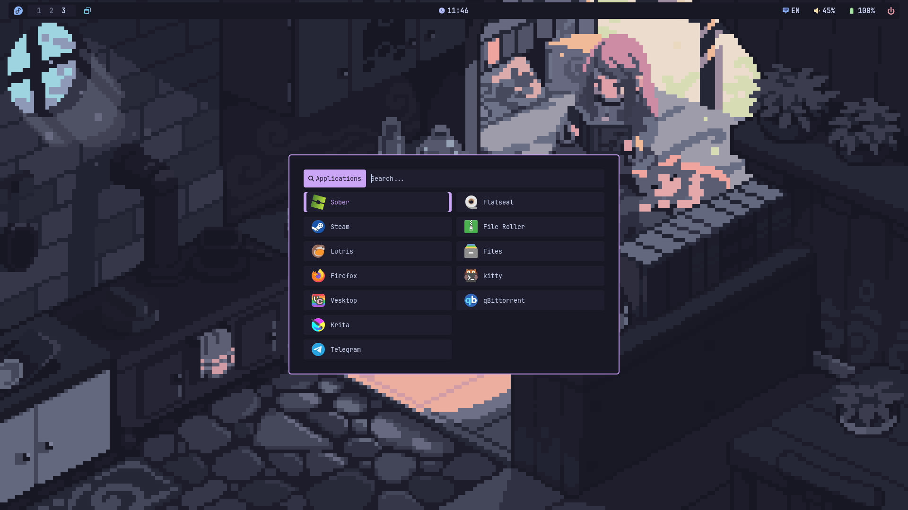
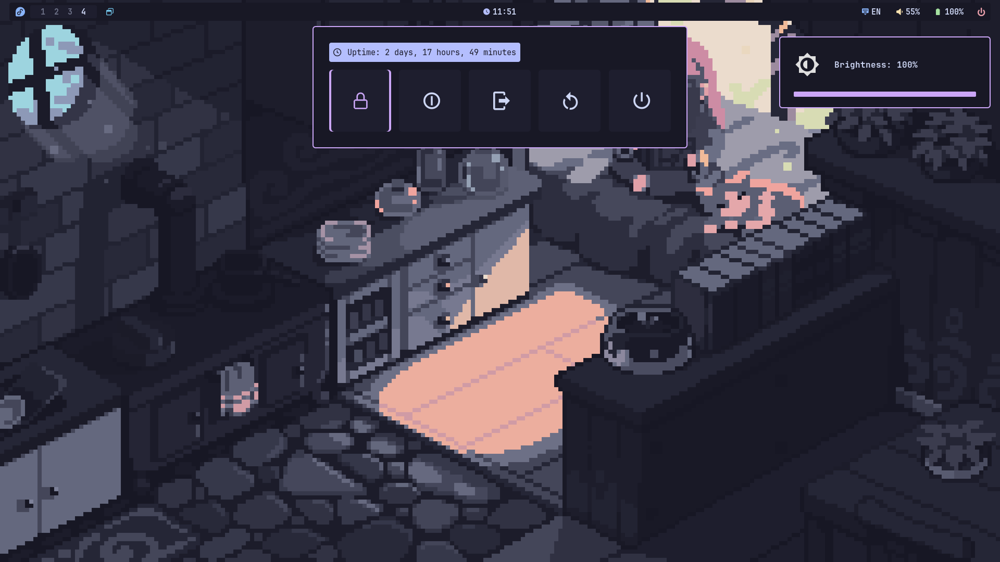
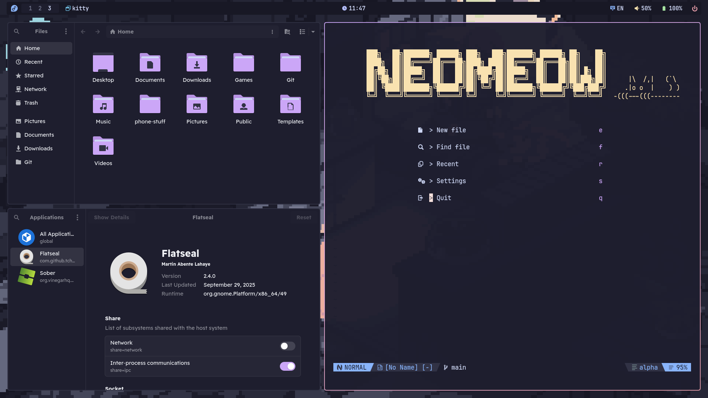
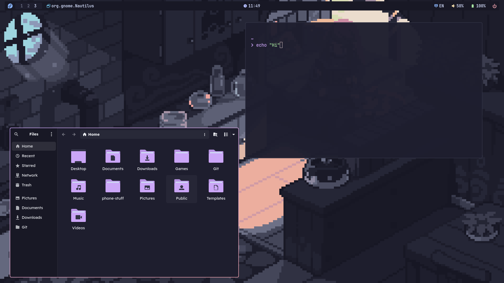

<h1 align="center">My personal dotfiles that uses Catppuccin Mocha</h1>

## Screenshots

| Rofi | Dunst & Powermenu |
|:---|:---------------|
|  |  |
| Some windows | Floating windows |
|  |  |

## Programs used
- **Compositor**: [Hyprland (Wayland)](https://hypr.land/)
- **Status Bar**: [waybar](https://github.com/Alexays/Waybar)
- **Notification daemon**: [dunst](https://github.com/dunst-project/dunst)
- **Browser**: [Zen](httpss://github.com/zen-browser/desktop)
- **Wallpaper daemon**: [swww](https://github.com/LGFae/swww)
- **Screenshot tool**: [grim](https://github.com/emersion/grim) + [slurp](https://github.com/emersion/slurp) + [hyprpicker](https://github.com/hyprwm/hyprpicker)
- **App Launcher**: [rofi](https://github.com/davatorium/rofi)
- **Terminal**: [ghostty](https://github.com/ghostty-org/ghostty)
- **Shell**: [fish](https://github.com/fish-shell/fish-shell) + [starship](https://github.com/starship/starship)

## Installing dotfiles
> WARNING: This script will make a backup of your `~/.config` to `~/.config-bak/`.
> This script works only with Arch, Void and Fedora, anything else is unsupported.

You can simply run this command:
```
bash install.sh
```

If you don't trust such scripts, you can install it manually as described [here](assets/MANUAL-INSTALL.md)

## Keybindings
| Shortcut                 | Action                                                   |
|--------------------------|----------------------------------------------------------|
| **`⌘ + Q`**              | Open terminal                                            |
| **`⌘ + B`**              | Open browser                                             |
| **`⌘ + E`**              | Open Nautilus                                            |
| **`⌘ + L`**              | Open Lutris                                              |
| **`⌘ + R`**              | Open launcher(Rofi)                                      |
| **`Shift + E`**          | Open config menu(Rofi)                                   |
| **`Shitt + W`**          | Open wifi manager(Rofi)                                  |
| **`⌘ + C`**              | Kill active window                                       |
| **`⌘ + V`**              | Toggles floating to active window                        |
| **`⌘ + J`**              | Toggles split                                            |
| **`⌘ + F`**              | Toggles fullscreen to active window                      |
| **`⌘ + Alt + ← → ↑ ↓`**  | Move floating window                                     |
| **`⌘ + Ctrl + ← → ↑ ↓`** | Resize floating window                                   |
| **`⌘ + ← → ↑ ↓`**        | Move focus to another window                             |
| **`⌘ + 1-9`**            | Switch workspaces                                        |
| **`⌘ + Shift + 1-9`**    | Switch workspaces + active window                        |
| **`⌘ + S`**              | Switch to special workspace                              |
| **`⌘ + Shift + S`**      | Switch to special workspace + active window              |
| **`⌘ + Scroll ↑ ↓`**     | Switch workspaces by scrolling                           |
| **`None + PrtSc`**       | Screenshot to ~/Pictures/Screenshots                     |
| **`Shift + PrtSc`**      | Screenshot with selection to ~/Pictures/Screenshots      |
| **`⌘ + U`**              | Restart Waybar                                           |
| **`⌘ + O`**              | Wallpaper randomizer(placeholder)                        |

> Volume, Brightness, Mic laptop keys supposed to work as expected

# Credits
- **[HyDE](https://github.com/HyDE-Project/HyDE)**: for providing excellent base for animations
- **[Rofi Themes](https://github.com/adi1090x/rofi)**: for providing a great base for Rofi
- **[Catppuccin colorscheme](https://catppuccin.com)**: for their beautiful colorscheme
- **[Midnight-Discord](https://github.com/refact0r/midnight-discord)**: for beautiful discord theme
