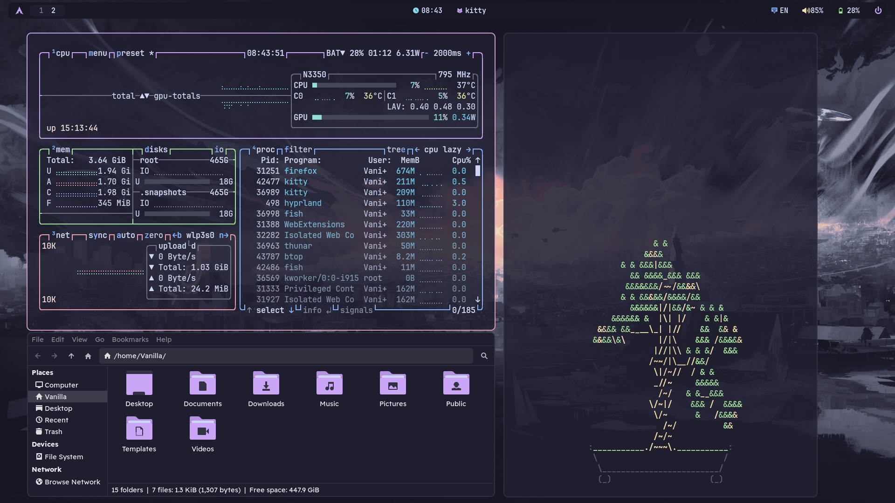
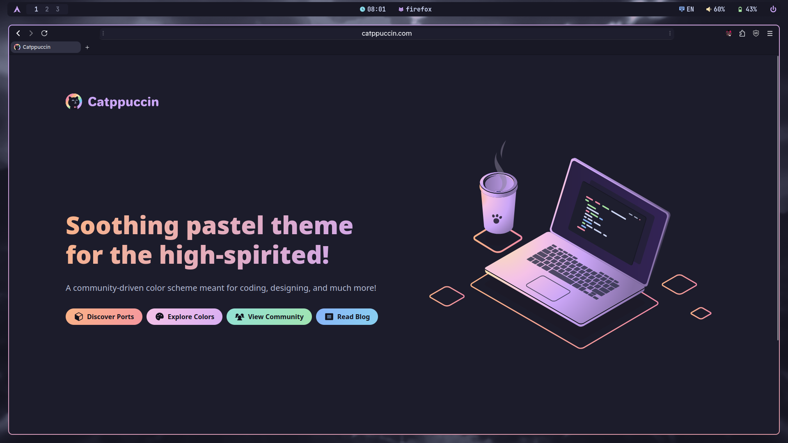
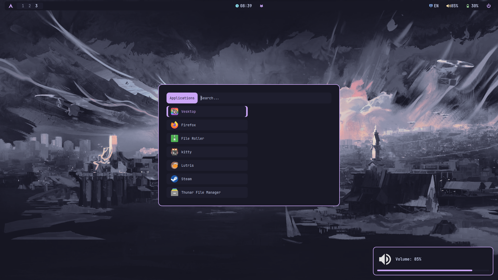
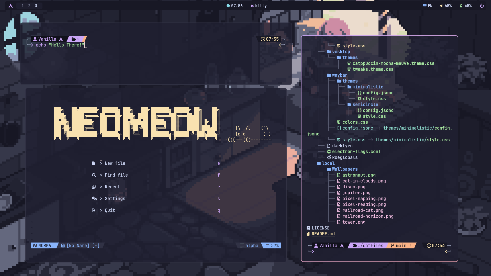

<h1 align="center"> My Hyprland config in awesome catppuccin colors</h1>

<!-- # Main -->

<!-- # Browser -->

<!-- # Rofi and notification applets -->

<!-- # Terminal stuff -->



## Programs in dotfiles
- **Compositor**: [Hyprland (Wayland)](https://hypr.land/)
- **Status Bar**: [waybar](https://github.com/Alexays/Waybar)
- **Notification daemon**: [dunst](https://github.com/dunst-project/dunst) (Also used for notification applets)
- **Browser**: Firefox
- **Wallpaper daemon**: [swww](https://github.com/LGFae/swww)
- **Screenshot tool**: [grim](https://github.com/emersion/grim) + [slurp](https://github.com/emersion/slurp) + [hyprpicker](https://github.com/hyprwm/hyprpicker) (to freeze screen during screenshot)
- **App Launcher**: [rofi (wayland fork)](https://github.com/lbonn/rofi)
- **Terminal**: [kitty](https://github.com/kovidgoyal/kitty)
- **Shell**: [fish](https://github.com/fish-shell/fish-shell) + [starship](https://github.com/starship/starship)


## Installing system packages

> I really recommend installing all this on a fresh system

### Arch
1. Install system packages
```
yay -S hyprland hyprlock hypridle xdg-desktop-portal-gtk xdg-desktop-portal-hyprland xdg-user-dirs brightnessctl sassc acpi grim slurp hyprpicker wl-clipboard wl-clip-persist \
    kitty firefox waybar rofi dunst swww nwg-look qt6ct nautilus gvfs file-roller vesktop starship swappy exa \
    noto-fonts noto-fonts-cjk noto-fonts-emoji ttf-font-awesome otf-bebas-neue-git \
    pipewire pipewire-pulse wireplumber darkly frameworkintegration nodejs npm
```

### Void
1. Add makrennel/hyprland-void and VanillaDaFur/xbps-templates for unavaliable packages in main repository.
```
sudo bash -c '
  echo "repository=https://raw.githubusercontent.com/Encoded14/void-extra/repository-x86_64-glibc" > /etc/xbps.d/10-hyprland-void.conf &&
  echo "repository=https://raw.githubusercontent.com/VanillaDaFur/xbps-templates/repository-x86_64-glibc" > /etc/xbps.d/10-extra-pkgs.conf
'
```

2. Install system packages
```
sudo xbps-install -S hyprland hyprland-qtutils hyprland-protocols hyprlock hypridle xdg-desktop-portal-gtk xdg-desktop-portal-hyprland \
    kitty firefox Waybar nautilus gvfs file-roller qt6ct darkly rofi nwg-look dunst vesktop libnotify swww swappy starship nodejs exa fzf grim slurp hyprpicker \
    brightnessctl sassc acpi polkit seatd elogind mate-polkit mesa-dri xorg-minimal xorg-server-xwayland xdg-user-dirs pipewire wireplumber wl-clipboard wl-clip-persist \
    google-fonts-ttf ttf-jetbrains-mono-nerd xorg-fonts 
```

3. Enable important services(and add yourself to the seatd group)
```
sudo bash -c '
  ln -sf /etc/sv/polkitd /etc/runit/runsvdir/default
  ln -sf /etc/sv/seatd /etc/runit/runsvdir/default
'
sudo usermod -aG _seatd $(whoami)
```

## Theming

### GTK
Install the Catppuccin GTK Theme
```
git clone https://github.com/VanillaDaFur/catppuccin-gtk.git --recurse-submodules
cd catppuccin-gtk
python -m venv cat
source cat/bin/activate
pip install -r requirements.txt
python build.py mocha -n catppuccin -d ~/.themes -a mauve --tweaks rimless normal
```

### Icons
Install Catppuccin Papirus Icons 
```
wget -qO- https://git.io/papirus-icon-theme-install | env DESTDIR="$HOME/.local/share/icons" sh
git clone https://github.com/catppuccin/papirus-folders.git 
cd papirus-folders
curl -LO https://raw.githubusercontent.com/PapirusDevelopmentTeam/papirus-folders/master/papirus-folders && chmod +x ./papirus-folders
cp -r src/* ~/.local/share/icons/Papirus
./papirus-folders -C cat-mocha-mauve --theme Papirus-Dark
```

### Cursor
Install Bibata-Modern-Classic cursor
```
wget https://github.com/ful1e5/Bibata_Cursor/releases/download/v2.0.7/Bibata-Modern-Classic.tar.xz
tar xvf Bibata-Modern-Classic.tar.xz -C $HOME/.local/share/icons
```

# Credits
- **[HyDE](https://github.com/HyDE-Project/HyDE)** for its great animations (I'm way too lazy to play with cubic bezier for them)
- **[Rofi Themes](https://github.com/adi1090x/rofi)** for their nice rofi applets and themes
- **[Catppuccin colorscheme](https://catppuccin.com/)** for their beautiful colorscheme
