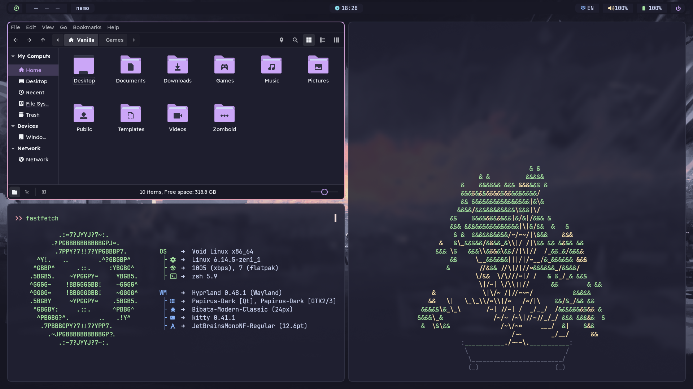
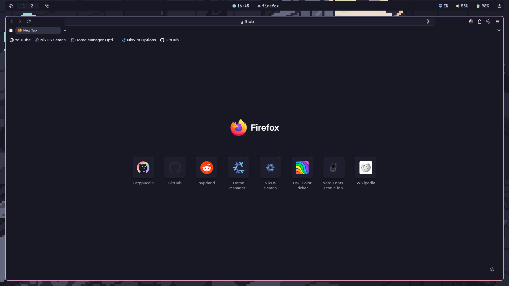
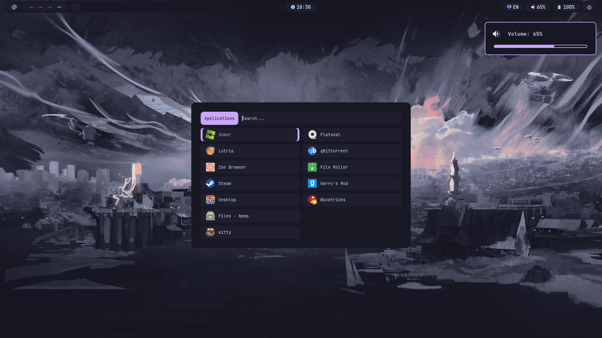

# My Hyprland config (in catppuccin mocha flavour) :3

Here some previews
ssets/image2.png)

# Installing system packages.

### Arch
Just copy this command
```
paru -S hyprland hyprlock hypridle swww xdg-desktop-portal-gtk xdg-desktop-portal-hyprland xdg-user-dirs kitty firefox waybar rofi-wayland dunst polkit-gnome brightnessctl sassc noto-fonts noto-fonts-cjk noto-fonts-emoji ttf-font-awesome ttf-jetbrains-mono-nerd pipewire pipewire-pulse wireplumber qt6ct qt5ct nwg-look dolphin ark vesktop-bin oh-my-posh-bin darkly-bin hyprshot ttf-readex-pro frameworkintegration nodejs npm swappy exa
```

### Void
This one is more complicated
1. Add makrennel/hyprland-void repository
```
bash -c 'echo "repository=https://raw.githubusercontent.com/Makrennel/hyprland-void/repository-x86_64-glibc" > /etc/xbps.d/hyprland-void.conf'
```
2. Now you can install *some* packages
```
xbps-install hyprland hyprland-protocols hyprlock hypridle swww xdg-desktop-portal-gtk xdg-desktop-portal-hyprland xdg-user-dirs kitty firefox Waybar dolphin dolphin-plugins ark qt6ct qt5ct xorg-minimal xorg-fonts xorg-server-xwayland brightnessctl sassc polkit seatd elogind polkit-gnome dunst mesa-dri swappy noto-fonts-ttf noto-fonts-cjk noto-fonts-emoji exa
```

3. Enable important services(and add yourself in seatd group)
```
ln -s /etc/sv/polkitd /etc/runit/runsvdir/default
ln -s /etc/sv/seatd /etc/runit/runsvdir/default
usermod -aG _seatd $(whoami)
```

### GTK
Installing Catppuccin GTK Theme
```
git clone https://github.com/catppuccin/gtk.git
cd gtk
python -m venv cat
source m/bin/activate.fish # remove ".fish" if you don't use fish
pip install -r requirements.txt
python build.py mocha -n catppuccin -d ~/.themes -a mauve --tweaks rimless normal
```
### Icons
Installing Catppuccin Papirus Icons 
```
wget -qO- https://git.io/papirus-icon-theme-install | env DESTDIR="$HOME/.local/share/icons" sh
git clone https://github.com/catppuccin/papirus-folders.git 
cd papirus-folders
curl -LO https://raw.githubusercontent.com/PapirusDevelopmentTeam/papirus-folders/master/papirus-folders && chmod +x ./papirus-folders
cp -r src/* ~/.local/share/icons/Papirus
./papirus-folders -C cat-mocha-mauve --theme Papirus-Dark
```

# Screenshots! 




